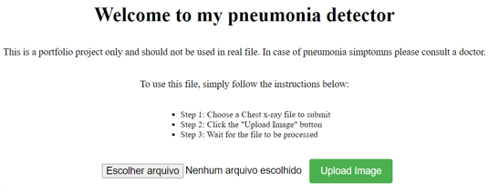
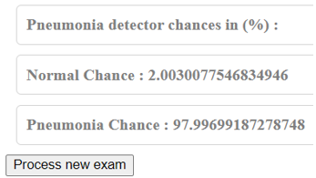
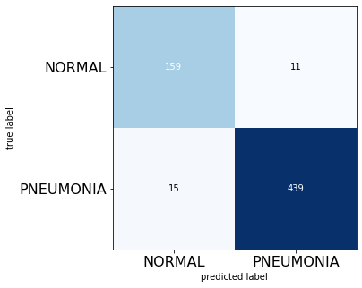
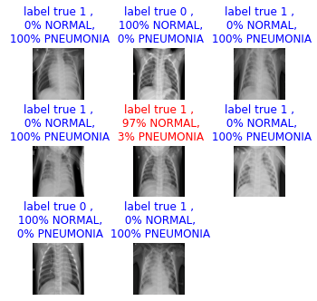
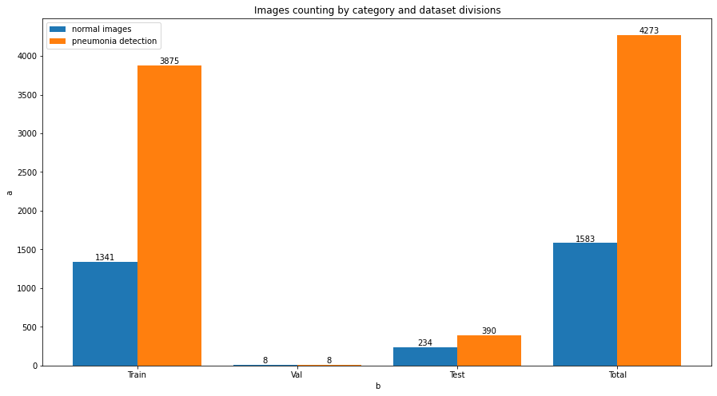
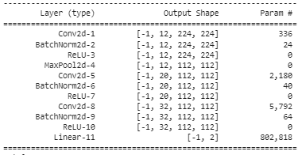
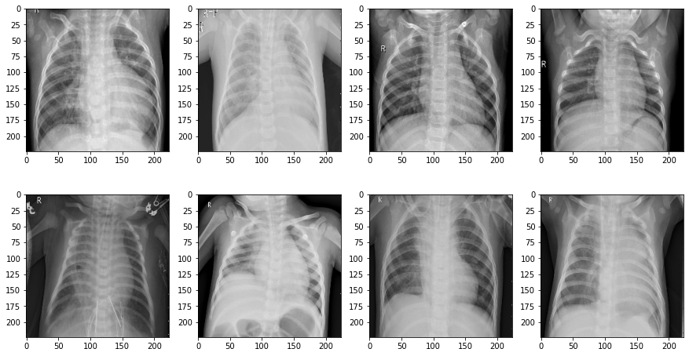
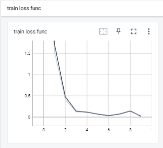
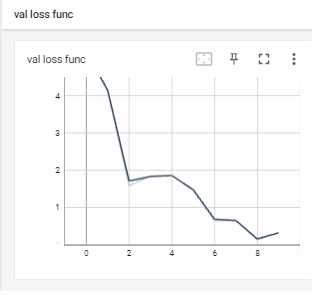

# Project 1: Chest X-ray Pneumonia Classifier

## Summary

**Tools: Python, Flask, Pytorch, AWS EC2, AWS S3, Paramiko**

Developed a Convolutional Neural Network (CNN) that classifies Chest X-Rays images within normal and pneumonia categories to help medical diagnosis in time and assertiveness, using Flask for API connections, option for AWS EC2 for processing and AWS S3 for data storage or the to use local processing and storage.

Developed a FLASK API to serve as the interface with users.

  
  

 
The CNN model was trained using the [kaggle Chest X-Ray pneumonia dataset](https://www.kaggle.com/datasets/paultimothymooney/chest-xray-pneumonia). The figures below show the results of the confusion matrix and a batch of the test dataset used to train the network.

  
  

# Table of contents
1.[How to Use](#How-to-Use)

2.[Data Exploratory Analisys](#Exploratory-Data-Analisys)

3.[Neural Network Development](#Neural-Network-Development)

4.[AWS Configuration](#AWS-Configuration)

5.[Future Implementation](#Future-Implementation)

## How to Use
Clone this git repo, choose if you want to run using local machine or to create a new reusable machine on AWS EC2. IF you select AWS, configure your AWS credentials in your development environment (VSCODE for example), configure your aws settings as explained in AWS Configuration Content, run the flask_app.py file using python > 3.8.10 and on your web browser enter your local host (usually http://127.0.0.1:5000/) wait until the page load and follow the instructions.
In your first run, it might take a few minutes to run because the it will automatically be created a new S3 bucket, a new EC2 instance and all the requirements libraries will be installed as well as all the files will be transfered.

## Exploratory Data Analisys
The exploratory data analisys for this project consist mainly in verifying the data distribuition between both normal and pneumonia classes. The image bellow show that for the training dataset the ratio from normal to pneumonia is 0.34:1 ratio, for the validation dataset is 1:1, for the test dataset is : 0.6 and for the total dataset is 0.37:1.

  

## Convolutional Neural Network Development

The IDE used to [construct the CNN](model_development/Pneumonia_CNN.ipynb) was Google Colaboratory web IDE with GPU as hardware acelerator. The model as developed Pytorch library and the the [kaggle Chest X-Ray pneumonia dataset](https://www.kaggle.com/datasets/paultimothymooney/chest-xray-pneumonia). The figures below show the model summary, a few images of the dataset, results of the train loss curve, validation loss curve, the confusion matrix and a batch of the test dataset used to train the network.

The CNN model was trained using the [kaggle Chest X-Ray pneumonia dataset](https://www.kaggle.com/datasets/paultimothymooney/chest-xray-pneumonia)

  
  

  
  

  
  

## AWS Configuration

  To configure the AWS settings enter the [aws_settings file](aws_files_config/aws_settings.py). To configure the EC2 instance, inside the *ec2_configuration_dict* function in the *dict_create_instance* pass the required information to create a new AWS instance, the required informatio is: Name of the instance, AMD ID, Instance type, User Data, Key pair name and AWS Region which corresponds to the variables called name of the instance in the AWS, image of the the AWS instances, the type of the instance to be selected, the data that will be passed, the key pair to access this instance via SSH and the region to create the instance.
  
  To configure the EC2 bucket, inside the *s3_configuration_dict* pass the bucket_region and the NAME_S3_BUCKET which corresponds to the region to create the bucket and the name of the bucket. Please do not change any variable not citated in this configuration content. 
  
  
## Future Implementation
For futur implementation of this project, GradCam might be an interesting tool to help physicians in order to have a better understanting of what the CNN is detecting in the image, therefore the raising their trust on the usage of the CNN.

